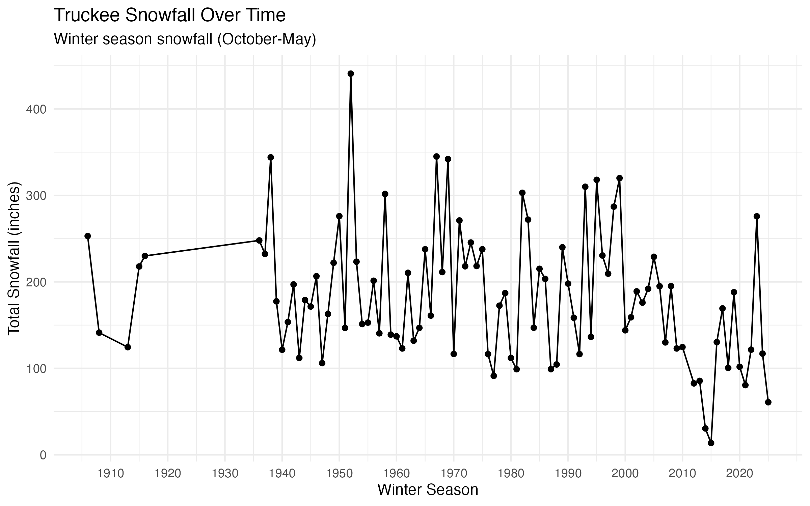
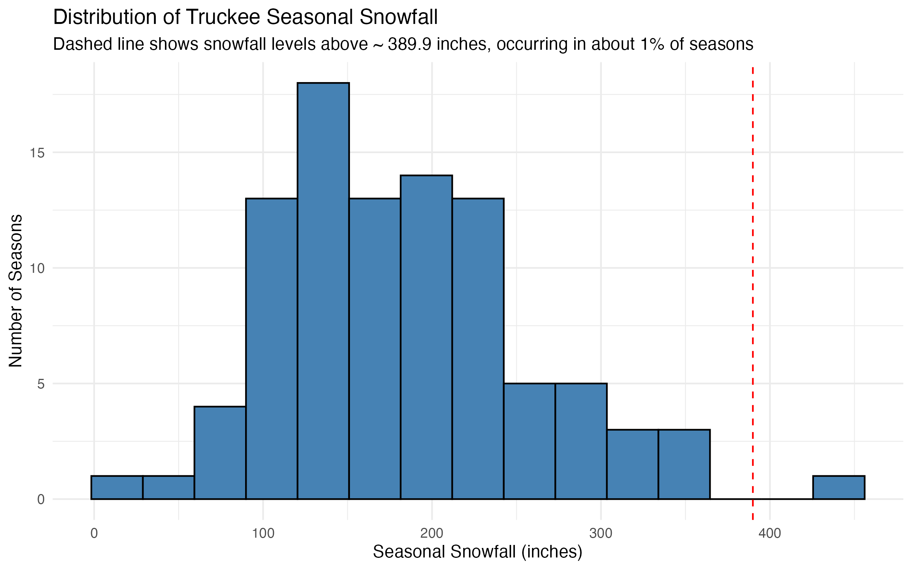
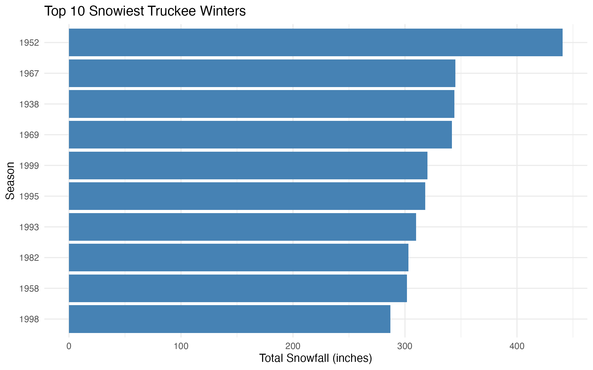

Extreme Snowfall Risk Analysis in Truckee, CA

Overview:
This project looks at how extreme snowfall can get in Truckee, California. Instead of just looking at average winters, I focused on the risk of really bad ones. The goal was to estimate how much snow could fall in a severe season and how often that might happen.

Data:
-daily snowfall data from NOAA:
- Truckee Ranger Station (1904–2009)
- Truckee Tahoe Airport (2009–2026)

I combined the datasets from the ranger station and airport to get more data points. Then I grouped the data into seasons from October through May (when it snows) and calculated total snowfall for each season.

Approach:
After cleaning the data, I added snowfall by winter season and got rid of seasons with incomplete data. 
To model extreme winters, winters with extremely high snowfall, I used a Generalized Extreme Value (GEV) distribution. 

Results:
- Estimated snowfall threshold only exceeded in about 1% of seasons: ~390 inches
- Highest observed snowfall: ~441 inches
- Probability a season exceeds 300 inches: ~9.6% (about once every 10 years)

  
Applications:
This model can be used in real life situations where extreme snowfall matters. In insurance, can help estimate the risk of winters that could be costly and can help insurers decide how much coverage or reinsurance to give. This model also can be useful for city planning because roads, buildings, drainage systems, etc. need to be able to handle heavy snowfall scenarios, even if unlikely. Ski resorts could use this to understand variability in snow seasons. Overall, the goal is to better understand rare but very impactful events, because those are the ones that cause the biggest issues.

Notes
- The analysis assumes conditions are relatively stable over time.
- Data comes from two nearby stations, so there may be small measurement differences.
-I completed this project independently, analyzing data using R
